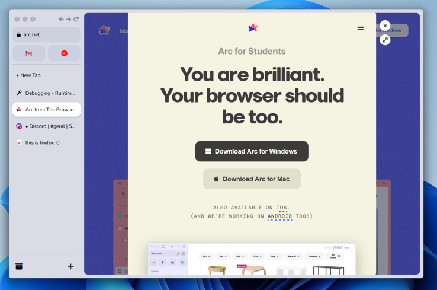

<pre>
ArcFox is back!!
Hello to all the amazing people that have been liking the project.
Today im here to announce arcfox and betterbrowser is officialy back!!
arcfox is being re-coded to be better and finally do what it should have done from the start.
hope y'all keep liking the project and helping it to grow.
you can keep eyes on the development through the roadmap bellow.
I divided the roadmap in things that have to be on the mvp to make arcfox usable
And things that would make it great but are not actually necessary.
If you want to contact us, open a <a href="https://github.com/betterbrowser/arcfox/issues">issue</a> or use our <a href="https://discord.gg/jDASpgt68t">discord</a>
</pre>

## Our Roadmap

### Essential:

- [x] Close, minimize and resize buttons.
  - [x] Close
  - [x] Minimize
  - [x] Resize
  - [x] Sidebar Toggle
  - [x] Color
- [x] Website Control Buttons
  - [x] Previous
  - [x] Next
  - [x] Reload
- [x] Search Bar
  - [x] Search Function
  - [x] Use User Search Engine
- [x] Show Tabs On Sidebar
  - [x] Show Tabs
  - [x] Close Button
  - [x] Reload Tab
  - [x] Mute Tab
  - [x] Copy Link
  - [x] Duplicate Tab
  - [x] Unload Tab
- [ ] Focus Mode
  - [ ] Open sidebar on hovering left

### Non-Essential:

- [x] Notes
  - [x] Share Notes
  - [x] Keep notes on refresh
  - [ ] Rich-text and Markdown features
  - [ ] Dynamic color
- [x] Peek
  - [x] Use Shift to Peek
  - [x] Works in most webpages (Report if smth doesn't work as expected)
  - [ ] Favorites Peek by default
- [ ] Folders
  - [ ] Folders Feature
  - [ ] Stackable Folders
  - [ ] Rename Folders
  - [ ] Pin Folder?
- [ ] Easels (under development)
  - [ ] Share Easels
  - [ ] Move elements
  - [x] Create and delete elements
- [ ] support for firefox-osx and firefox based browsers
  - [ ] MacOS
  - [ ] Linux
  - [ ] Librewolf
  - [ ] TOR
  - [ ] PaleMoon
  - [ ] WaterFox
- [ ] Bookmarks
  - [ ] Show Bookmarks
  - [ ] Add Bookmark Tab Context Menu
  - [ ] Always Open Bookmarks
- [ ] Settings
  - [ ] Change Search Engine
  - [ ] Change Shortcuts
- [ ] Library
  - [ ] History
  - [ ] Downloads
  - [ ] Bookmarks
- [ ] Spaces
  - [ ] Spaces Feature
  - [x] Rename Spaces
  - [ ] Change Spaces Icon
- [ ] Launchpad (you can use omni while it's not out)
- [ ] Boosts
  - [ ] Boosts Feature
  - [ ] Boosts Store
  - [x] Arc Palette

ArcFox still has a lot of features to be implemented and you can see our <a href="https://github.com/orgs/betterbrowser/projects/2">Full Roadmap</a> for a better understanding of the upcoming features and things we are working on :D

  
  

   
  

  <h1 align="center"><b>ArcFox</b></h1>
  

  Make firefox flow like arc
     
    <a href="https://github.com/betterbrowser/arcfox/releases"><strong>Install »</strong></a>
     
  

# What is ArcFox?

ArcFox is a pack of firefox improvements that brings the appearance and some of the features of arc browser to firefox. Recently, The Browser Company © (the developers of arc browser) announced a Windows version, so this project almost lost the reason to exist. But there's still a linux version to be made and some people just like firefox and don't want to change.

I really recomend you to give a try on arc browser if you can. But we gonna do our best to make firefox nice as arc.

# Installation

### ArcFox-core Installation

To install arcfox-core you need to download it on your firefox, we recommend you to download from the official addon store:

> Warning: To use arcfox you need arcfox theme!!

<a href="https://addons.mozilla.org/firefox/addon/arcfox/">
  </img>
</a>

### ArcFox-Theme Installation

To install arcfox-theme you need to open your firefox configurations and turn style modification on. To do that please follow this steps:

- Digit <a href="about:config">"about:config"</a> on firefox address bar and click enter.
- On the search bar, search for "toolkit.legacyUserProfileCustomizations.stylesheets" and set the value to "true".
- Open <a href="about:support">"about:support"</a> and click on the “Open Folder” button on the right of "Profile Folder" to open it.
- When the folder opens, search for a folder called "chrome", if you don't find it create one.
- Inside the "chrome" folder, drop the "userChrome.css" that you find on the <a href="https://github.com/betterbrowser/arcfox/releases">releases.</a>
- Restart firefox.

# Removing ArcFox

If you have a major issue, or just want a different/default look, here is how to remove ArcFox.

1. Remove `(Firefox Profile)/chrome/userchrome.css`

2. Remove the 'ArcFox' extension from Firefox

3. Restart your Firefox session, and it should be fixed! If not, make an issue in the issues tab

4. Be happy with your now boring and unproductive firefox!

# Support

If you have any problems you can open a issue on this repository or contact our team on our [Discord](https://discord.gg/jDASpgt68t).

And if you want to support ArcFox and BetterBrowser in a financial way you can donate to the developer [ko-fi](https://ko-fi.com/nikollesan) page

# License

Arcfox is distributed under [MIT License](/LICENSE).
