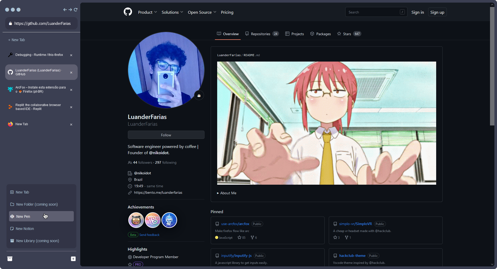

  
  

   
  

  <h1 align="center"><b>ArcFox</b></h1>
  

  Make firefox flow like arc
     
    <a href="https://github.com/use-arcfox/arcfox/releases"><strong>Install »</strong></a>
     
  

# What is ArcFox?

ArcFox is a pack of firefox improvements that brings the appearance and some of the features of arc browser to firefox. Recently, The Browser Company © (the developers of arc browser) announced a windows version, so this project almost lost the reason to exist. But there still a linux version to be made and some people just like firefox and don't want to change.

> NOTE: Arcfox is a side-project under development.

I really recomend you to give a try on arc browser if you can. But we gonna do our best to make firefox nice as arc.

# Installation
To use ArcFox you need to install arcfox-core and arcfox-theme (in this specific order). To proceed with the instalation, use the tutorial below. Using arcfox-core and arcfox-theme together is the best way to use ArcFox!

### ArcFox-core Installation
To install arcfox-theme you need to download it on your firefox, we recommend you to download from the official addon store. To do that please follow this steps:

- Download arcfox-core from this [link](https://addons.mozilla.org/en-US/firefox/addon/arcfox/)
- It should start to work just fine :D

### ArcFox-Theme Installation
To install arcfox-theme you need to open your firefox configurations and turn style modification on. To do that please follow this steps:

- Open <a href="about:config">"about:config"</a> on firefox.
- On the search bar, search for "toolkit.legacyUserProfileCustomizations.stylesheets" and set the value to "true".
- Open <a href="about:support">"about:support"</a> and click on the “Open Folder” button on the right of "Profile Folder" to open it.
- When the folder opens, search for a folder called "chrome", if you don't find it create one.
- Inside the "chrome" folder, drop the "userChrome.css" that you find on the <a href="https://github.com/use-arcfox/arcfox/releases">releases.</a>
- Restart firefox.

## Known Problems
Thanks to the beautiful beta-testers, arcfox is improving everyday! this is some of the things we are aware of and working hard to solve! Some of they are urgent and are main things to use it and we know that. You can know how the project is going on our discord! (link coming soon)

### The sidebar tabs names are not updating. (solved)
- I'm trying to solve it (https://github.com/use-arcfox/ar...)

### When sidebar close it never open again
- I'm developing a shortcut for open it! (https://github.com/use-arcfox/ar...)

### It crashes using linux on low-end computers
- I don't know why it's happening, and at the moment i can't analyze it. So this problem gonna persist for some time, sorry :(

## Help Wanted!!
I'm having a lot of problems on updating the tab names without making the active tab lossing it's css. If you are better with js than me or know how to solve it, please be free to do a pull-request! I'm gonna be so gratefull. Also, if you have any ideas that can improve arcfox pls open a issue with your idea :)

# Support
If you have any problems you can open a issue on this repository or contact the developer [here](https://discord.gg/VRBVsjJ7NQ)

# License
Arcfox is distributed under [MIT License](/LICENSE).
